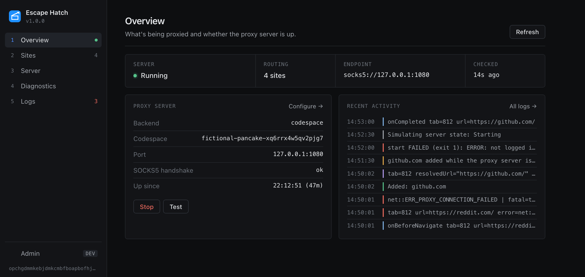
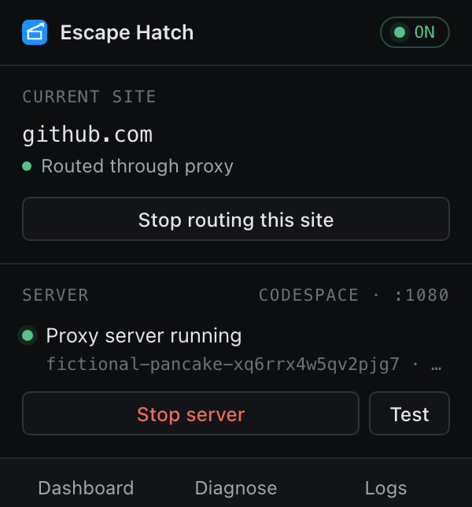
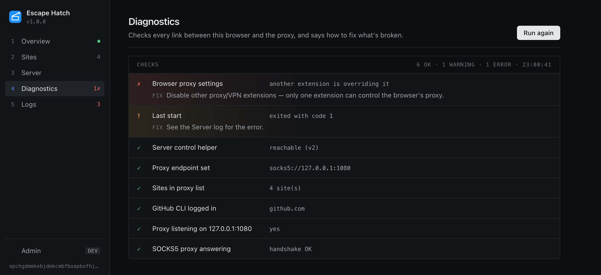
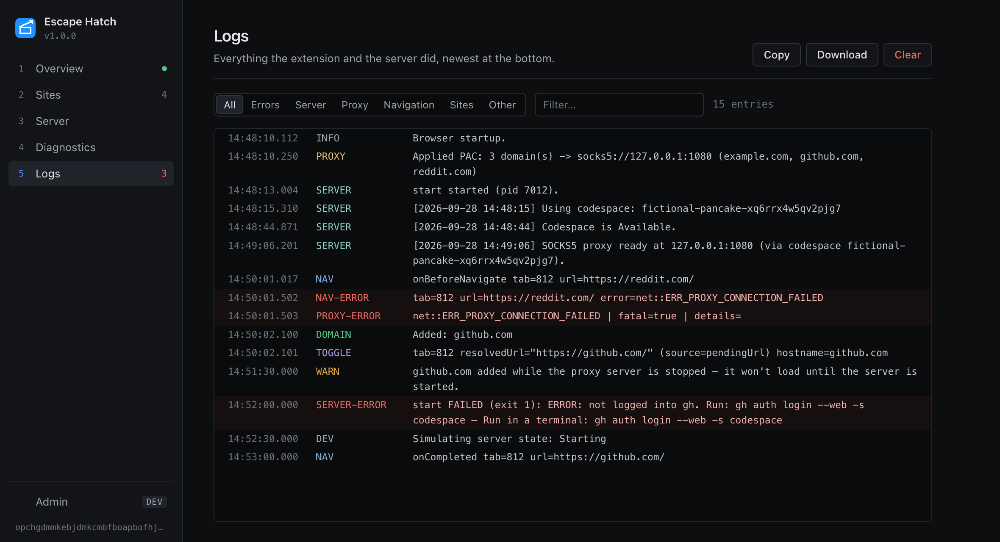
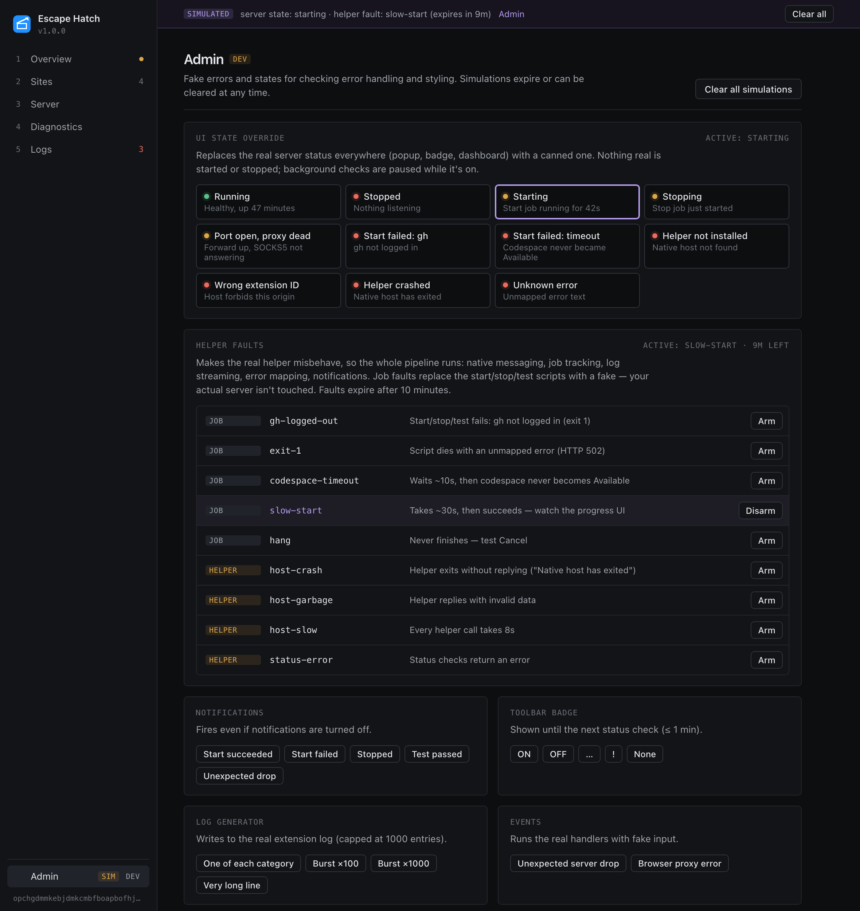
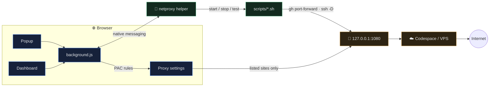

<div align="center">


# Escape Hatch

**Route only the sites you choose through your own SOCKS5 proxy.<br/>Everything else stays direct.**

[](extension/manifest.json)
[](docs/setup.md)
[](docs/setup.md)
[](docs/setup.md)
[](docs/setup.md)
[](docs/setup.md)
<br/>
[](docs/setup.md)
[](native-host/netproxy_host.py)
[](docs/setup.md#github-codespace-default)
[](docs/setup.md#ssh-tunnel-to-a-vps)

[**Setup**](docs/setup.md) &nbsp;·&nbsp; [**Features**](docs/features.md) &nbsp;·&nbsp; [**How it works**](docs/how-it-works.md) &nbsp;·&nbsp; [**Troubleshooting**](docs/errors.md) &nbsp;·&nbsp; [**All docs**](docs/README.md)

<br/>



</div>

<br/>

## ✨ Features

<table>
<tr>
<td width="50%" valign="top">

🎯 **Per-site routing**<br/>
One click in the toolbar routes the current site (and its subdomains) through
the proxy. Everything else keeps its normal, direct connection.

</td>
<td width="50%" valign="top">

🚀 **One-click server**<br/>
Start, stop, test or cancel the proxy from the browser, backed by a GitHub
Codespace or your own VPS over SSH. No terminal needed.

</td>
</tr>
<tr>
<td valign="top">

🩺 **Diagnostics that say what to do**<br/>
Checks every link from browser to proxy, including a real SOCKS5 handshake
and other extensions hijacking the proxy, with a fix for each problem.

</td>
<td valign="top">

🔔 **Badge & notifications**<br/>
<code>ON</code> / <code>OFF</code> / <code>…</code> / <code>!</code> on the
toolbar icon, and desktop alerts when a start fails or the proxy drops
unexpectedly.

</td>
</tr>
<tr>
<td valign="top">

💾 **Settings survive reinstalls**<br/>
Sites and settings are backed up outside the browser and restored
automatically after an uninstall. Import/export included.

</td>
<td valign="top">

🧪 **Admin tab for testing**<br/>
Fake server states, helper crashes, failed starts, log floods and
notifications to check error handling without breaking anything.

</td>
</tr>
</table>

## 📸 Screenshots

<table>
<tr>
<td align="center" valign="top" width="34%">
<br/>
<sub><b>Toolbar popup</b> — route this site, start/stop the server</sub>
</td>
<td align="center" valign="top">
<br/>
<sub><b>Diagnostics</b> — every check, with a fix for what's broken</sub>
</td>
</tr>
</table>

<details>
<summary><b>More screenshots</b> — Logs, Admin</summary>
<br/>

<br/>
<sub><b>Logs</b> — filter by category, search, download everything for a bug report</sub>

<br/><br/>

<br/>
<sub><b>Admin</b> — simulate states and faults to test error handling</sub>

</details>

## 🚀 Quick start

**1. Load the extension.** Open `vivaldi://extensions` (or `chrome://`,
`edge://`, …), turn on **Developer mode**, click **Load unpacked** and pick the
`extension/` folder.

**2. Register the server-control helper** (once per browser). The dashboard's
**Server** tab shows this exact command with a Copy button:

```sh
native-host/install.sh opchgdmmkebjdmkcmbfboapbofhjljnm
```

**3. Pick a backend** on the Server tab:

| | Backend | You need |
| :-: | --- | --- |
|  | **GitHub Codespace** *(default)* | `brew install gh` then `gh auth login --web -s codespace` |
|  | **SSH tunnel to a VPS** | Run `vps-setup/setup-vps.sh` on the server, then fill in `scripts/tunnel.env` |

**4. Point it at the proxy.** Endpoint **SOCKS5** · `127.0.0.1` · `1080`, then **Save**.

**5. Go.** Press **Start**, wait for the green dot, and click **Route through
proxy** on any site you want to reach.

> [!TIP]
> Something not working? Open the **Diagnostics** tab. Every failing check comes
> with the fix. Full guide: [Errors & troubleshooting](docs/errors.md).

> [!WARNING]
> If the proxy is down, the browser falls back to a **direct** connection for
> routed sites. On a network that blocks them they still won't load, but on an
> open network they'll load *without* the proxy. The badge shows **OFF** when
> this can happen. [Details](docs/how-it-works.md#routing-sites-through-the-proxy)

## 🧭 How it works



The extension builds proxy rules for the browser from your site list. A small
local helper (`native-host/`) runs the server scripts for it, because
extensions can't start programs themselves. The full walkthrough is in
[How it works](docs/how-it-works.md).

## 🗂️ Repository layout

<details>
<summary>Show the tree</summary>

```text
extension/         Manifest V3 extension
  popup.*            toolbar popup
  options.* admin.js dashboard: Overview · Sites · Server · Diagnostics · Logs · Admin
  background.js      proxy rules, helper calls, health checks, badge, notifications
  ui.css dashboard.css
native-host/       helper the browser launches (Python) + install.sh + fault-job.sh
scripts/           server control: codespace-*.sh, *-tunnel.sh, lib.sh, netproxy CLI
vps-setup/         one-time VPS hardening for the SSH-tunnel backend
tools/preview/     headless screenshots of every view (shoot.sh)
tools/test/        background.js simulation tests
docs/              setup, features, how it works, errors, admin, development
dns_block_test.sh  checks whether a network blocks DoH / Cloudflare endpoints
```

`codespace-repo/` (gitignored) is a separate checkout of
[`Comiclyy/escapehatch-proxy`](https://github.com/Comiclyy/escapehatch-proxy),
the devcontainer that runs the proxy inside the Codespace.

</details>

## ⌨️ `netproxy` CLI

Prefer a terminal? Link the CLI onto your PATH:

```sh
ln -s "$PWD/scripts/netproxy" ~/bin/netproxy
```

| Command | Does |
| --- | --- |
| `netproxy start` / `stop` | Bring the Codespace proxy up / shut it down |
| `netproxy test` | Check traffic exits through the proxy, not your own IP |
| `netproxy status` | Tunnel and Codespace state |
| `netproxy log [n]` | Follow `logs/netproxy.log` |
| `netproxy sitelog` / `netlog` | Follow the proxy's connection log / everything combined |

## 🧑‍💻 Development

```sh
tools/preview/shoot.sh          # render every view to tools/preview/out/*.png
tools/preview/shoot.sh --readme # refresh the images in this README
JSC=/System/Library/Frameworks/JavaScriptCore.framework/Versions/Current/Helpers/jsc
$JSC tools/test/background-sim.js extension/common.js extension/background.js tools/test/background-sim-run.js
```

Conventions, file layout and testing the helper by hand are in
[Development](docs/development.md).

<div align="center">
<br/>
<sub>Made for networks that block too much.</sub>
</div>
