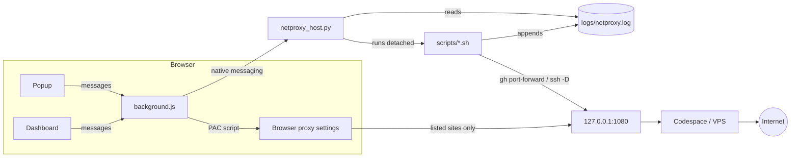

# How it works

There are four pieces:

1. **The extension** (`extension/`) — decides which sites use the proxy, and
   is the user interface.
2. **The helper** (`native-host/netproxy_host.py`) — a small local Python
   program the extension talks to, because extensions can't run programs
   themselves.
3. **The server scripts** (`scripts/`) — bring the proxy up and down. Codespace
   or SSH tunnel.
4. **The proxy** — a SOCKS5 server reachable at `127.0.0.1:1080`, forwarded
   from a GitHub Codespace (microsocks) or a VPS (`ssh -D`).

## Routing sites through the proxy

`background.js` builds a PAC ("proxy auto-config") script from the site list
and hands it to the browser with `chrome.proxy.settings`. For every request
the browser runs it:

- If the host is a listed domain or a subdomain of one (`www.` ignored), the
  answer is `SOCKS5 127.0.0.1:1080; DIRECT`.
- Otherwise the answer is `DIRECT`.

The rules are re-applied whenever the list or the endpoint changes. With no
endpoint or no sites, the rules are removed completely.

> **Note on `; DIRECT`.** If the proxy can't be reached, the browser falls back
> to connecting **directly** instead of failing. On a network that blocks the
> site, the page still won't load. On an open network, though, a routed site
> will quietly load *without* the proxy. That's why the badge shows **OFF**
> when sites are listed but the server is down.

The extension can only control the proxy if no other extension does. If a VPN
or proxy extension has taken control, Diagnostics reports it.

## The popup and dashboard talk to the background

The popup and dashboard never touch the proxy or the helper directly. They
send messages to `background.js` (`chrome.runtime.sendMessage`):

| Message | Does |
| --- | --- |
| `toggleCurrentTab` | Add or remove the active tab's site, then reload it. |
| `addDomain` / `removeDomain` | Edit the site list. |
| `applyProxySettings` | Rebuild and apply the PAC rules. |
| `serverAction` `{action}` | `start` / `stop` / `test` / `cancel`. |
| `serverStatus` | Ask the helper for status and cache it. |
| `serverLog` `{lines}` | Tail of `logs/netproxy.log`. |
| `diagnose` | Run all checks. |
| `clearLog` | Empty the extension log. |
| `dev*` | Admin tab actions (see [Admin](admin.md)). |

Every message gets a reply. If handling one throws, the error is logged as
`ERROR` and returned to the sender, instead of the sender being left with
"message channel closed".

Live updates don't need polling from the pages. The background writes state
to `chrome.storage`, and the popup and dashboard re-render on
`storage.onChanged`.

## The helper (native messaging)

The browser launches the helper **once per request**. It sends one JSON
message on stdin, prefixed with its length, and expects one reply on stdout.
The helper is registered by `native-host/install.sh` under the name
`com.escapehatch.netproxy` (see [Setup](setup.md#2-register-the-server-control-helper)).

| Command | Reply |
| --- | --- |
| `ping` | Helper version. |
| `status` | `listening` (port open), `socksOk` (real SOCKS5 handshake), running `job`, `lastJob` with exit code, codespace name. |
| `start` / `stop` / `test` | Starts the backend's script **detached** and returns immediately with the job. |
| `cancel` | Kills the running job's whole process group. |
| `log` `{lines, offset}` | Last N lines, or only what was appended since a byte offset. |
| `doctor` | Helper-side health checks, each with a fix. |
| `settings-save` / `settings-load` | Write/read the settings backup (`~/.config/eschatch/settings.json`). |
| `fault` | Arm, clear or query a fault ([Admin](admin.md)). |

Because the browser starts the helper with a bare PATH, the helper adds
`/opt/homebrew/bin`, `/usr/local/bin` and `~/bin` itself, so `gh`, `ssh` and
`curl` are found.

## Starting the server, step by step

1. You press **Start**. `background.js` notes the current end of the server
   log, then sends `start` to the helper.
2. The helper runs `scripts/codespace-start.sh` (or `start-tunnel.sh`) in its
   own process group, detached. A wrapper records the script's exit code to
   `/tmp/escapehatch-netproxy-job.exit`. The job itself is described in
   `/tmp/escapehatch-netproxy-job.json`.
3. Every 2 s, `background.js`:
   - reads new log lines since its offset, and copies each into the extension
     log as `SERVER` or `SERVER-ERROR`
   - asks for status, which updates the popup, dashboard and badge
4. When the job ends, one last log read catches any final lines. The last
   error line is usually the real cause, and it lands right as the script
   exits.
5. The outcome:

   | Exit code | Result |
   | --- | --- |
   | 0, proxy listening | Success. Clears any stored failure and sends a success notification. |
   | 130 | Cancelled. Not treated as a failure. |
   | anything else | Failure. The last error line (or the exit code) is stored for 10 minutes, so the popup and dashboard can show *"Last start failed: …"*, and a failure notification is sent. |

6. After 5 minutes the extension stops following the job (it keeps running)
   and says so. Use **Cancel** to kill it.

Pressing **Stop** marks the shutdown as expected, so the health check doesn't
report it as an unexpected drop.

## Settings that survive an uninstall

Everything in `chrome.storage` is deleted when the extension is uninstalled,
so the helper keeps a copy on disk:

1. **Every change:** after any change to the settings, `background.js` waits
   ~1 s (so a burst of edits becomes one save), then sends `settings-save`.
   The helper writes the new file and renames it into place, so a crash can't
   leave a half-written file. The previous version is kept as
   `settings.json.bak`.
2. **Fresh install:** when the browser reports a fresh install (not a reload
   or update), `background.js` sends `settings-load` and merges the backup in.
   - Sites are **added**, never removed.
   - Other settings are only filled in where they're still at their defaults.
3. **Safety:**
   - If the helper can't be reached at install time (not registered yet), the
     restore is marked *pending*.
   - While it's pending, **nothing is backed up**. Otherwise the empty new
     install would overwrite the good backup.
   - The minute-by-minute health check retries the restore until it succeeds.
4. **Existing installs:** on reload or update, if no backup exists yet, one is
   made.

The Sites tab shows the backup's state. Diagnostics warns if the backup is
missing or doesn't match the browser.

## State and storage

| Where | Key | Holds |
| --- | --- | --- |
| `storage.sync` | `domains`, `proxyScheme`, `proxyHost`, `proxyPort`, `serverBackend`, `notifications` | Your settings. |
| `storage.local` | `eventLog` | The extension log (newest 1000 entries). |
| | `restorePending` | A fresh-install restore is waiting for the helper; backups are held until it's done. |
| `storage.session` | `serverState` | Latest status. This is what every view renders. |
| | `serverLastFailure`, `serverExpectDown`, `serverUpSince` | Last failure (10 min), "a Stop was requested", uptime start. |
| | `lastProxyError`, `navTargets` | Last browser proxy error; the address each tab is trying to load. |
| | `devOverride`, `dashboardOpenTo` | Admin UI-state override; which dashboard tab the popup asked for. |
| | `settingsBackup` | Result of the last backup (for the Sites tab and warnings). |

Session storage is cleared when the browser quits.

## Files on disk

| Path | What |
| --- | --- |
| `~/.config/eschatch/settings.json` (+ `.bak`) | Settings backup: sites, endpoint, backend, notifications. Survives uninstalling the extension and moving the repo. |
| `logs/netproxy.log` | Everything the scripts do. Rotated to `.1` at 1 MB. |
| `logs/native-host.log` | One line every time the browser launches the helper, plus replies to anything other than status/log polls. Rotated at 256 KB. **Empty means the browser isn't finding the helper.** |
| `/tmp/escapehatch-codespace-name` | Codespace in use. |
| `/tmp/escapehatch-codespace-forward.pid` / `.log` | The `gh codespace ports forward` process and its output. |
| `/tmp/escapehatch-tunnel.pid` | The `ssh -D` process (tunnel backend). |
| `/tmp/escapehatch-netproxy-job.json` / `.exit` | Current/last job and its exit code. |
| `/tmp/escapehatch-netproxy-fault.json` | Armed Admin fault, if any. |
